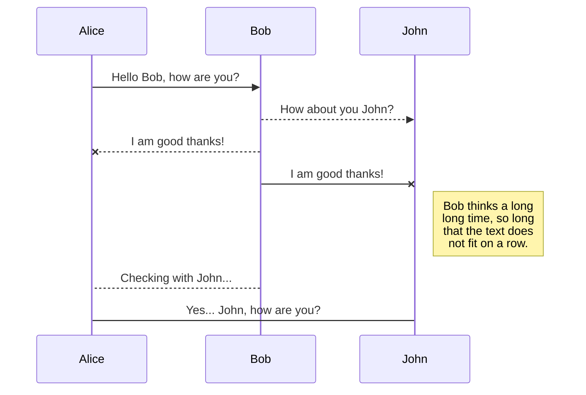
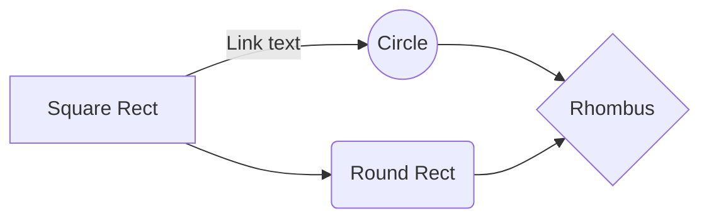

# PEC3: Visionando el futuro con las gafas de Manovich

Autor: Pablo Morell Vidal  

Fecha: 13/12/2023

https://github.com/mgea/PEC3_Manovich_Reloaded

 

# HIBRIDACION

Vamos a analizar con las gafas de Manovich dos ejemplos de hibridacion, en este caso [NOTION.SO](https://www.notion.so/) y [MS TEAMS](https://www.microsoft.com/es-es/microsoft-teams/group-chat-software).

Notion es un gestor de tareas asi podemos dejar atras las libretas donde llevar las tareas que tienes que hacer, evitando asi quedarnos sin papel u olvidarnos de la misma.

MS Teams la plataforma mas famosa para hacer reuniones que vio su mayor aumento de uso en la pandemia donde el mundo se modernizo y en muchos trabajos se dio la posibilidad de trabajar y la mejor forma para mantener el contacto con los compañeros fue a traves de este tipo de plataformas

# NOTION: La hibridacion de las notas
Notion es una aplicacion web o aplicacion de escritorio para sistemas Windows o MAC OS que permite la gestion de tareas tanto individual como para equipos.
La gestion de tareas ha sufrido una gran hibridacion ya que pasamos de tener una libreta con todas las tareas apuntadas a tener todas estas tareas en la red, con la posibilidad de asignarla a una persona estas tarea y poder fijar fecha de vencimiento
Gracias a los avances que ha sufrido la tecnologia podemos asignar a nuestrar tareas acciones automaticas cuando pase algo con una tarea, por ejemplo, cuando una tareas esta cerca de su fecha de vencimiento y no este completada se mandará una mensaje automaticamente a slack para recordar que esta cerca de su finalizacion o tenemos otras posibilidades añadir campos personalizados a nuestras tareas o etiquetas, pudiando hacer asi filtros.
A todo esto se le suma la posibilidad de que se puede usar de manera empresarial se paga una licencia y se nos permite que varias personas puedan editar tareas de un mismo tablero y asignar una tarea a una persona en especifico la cual podra añadir comentarios e informas de estado de la tarea actual 

A estar pensado para un entorno empresarial, se puede crear diferentes tipos de tareas.

- Bloques basicos
	> - Encabezados, Texto, Tabla
	> - Lista enumerada, Desplegable
	> - Divisor, Destacado, Enlace a una página

Insertar imagen de bloque basic	

- Contenido Multimedia
	> - Imagen, Marcador Web, Video
	> - Audio, Codigo, Archivos

- Base de datos 
	> - Vista de tabla, Vista de tablero
	> - Vista de cronograma, Vista de galeria
	> - Divisor, destacado, enlace a una página

- Inserciones
	> - Archivos de google drive, Tweet, Figma
	> - Codepen, Gitlab, Trello
	> - Adobe XD, Jira y mas

Plantillas
Para la gestion de tareas nos encontramos tambien la posiblidad de crear plantillas o importarlas de las personas, estas plantillas pueden ser de pago o gratuitas, una vez importadas a tu proyecto se pueden modificar al gusto del equipo o la persona

Tenemos cientos de posibilidad a la hora elegir plantillas

1. Uso profesional
   - Producto
     - Especifcaciones del producto
     - Wiki de producto
     - Etc
   - Marketing
     - Calendario editoria del blog
     - Resumen de la campaña
     - Etc
   - Desarrollo
     - Especificaciones técnicas de desarrollo
     - Wiki de desarrollo
   - Diseño
     - Portafolio de diseño
     - Spirnt de diseño
   - Ventas
     - Activos de ventas
     - CRM de ventas
   - Busqueda de candidatos
     - Guia para entrevistas
     - Registro de contrataciones
     - Etc
   - RR. HH
     - Pagina de inicio de la empresa
     - Beneficios de los empleados
     - ETc
2. Uso educativos
   - Cursos
   - Clubs
   - Docencia
   - Investigacion academica
3. Personal
   - Pasatiempos
   - Viajes
   - Etc
4. Proyectos
   - Hoja de ruta y calendarios
   - Registro de incidencias
   - Etc
5. Wiki
   - Intranet de la empresa
   - Comuncaciones interna y actualizaciones
   - Etc
7. Documentos
   - Propuestas y presentaciones
   - Planificacion de proyectos
   - Etc

	
	>Solo en la primera plantilla he descrito la mayoria de subapartados, ya que como podemos ver esto son solo las plantillas que nos ofrece el propio notion, es decir, no son plantillas de la comunidad y ya tenemos cientos de plantillas

Gracias a estas herramientas y la gran posibilidad que tenemos a la hora de organizar tareas no veo util seguir usando libretas para organizar un equipo y que las propias personas del equipo no esten actualizadas en todo momento, gracias a una pagina web, una persona al terminar la tarea entraria de nuevo a notion y veria la siguiente tarea asignada

# MS TEAM

Microsoft Teams es una tanto una aplicacion web como aplicacion de escritorio para Windows, nos permite tener chat individuales con mensajeria instatanea y tambien nos permite crear grupos para tener chats grupales instataneos y llamadas grupales.

Microsoft Teams ganó una gran popularidad en los años de la pandemia, en este caso en españa gano gran popularidad en el año 2020 cuando tuvimos un confinamiento en el cual algunas personas seguian trabajando y en las cuales surjuio en muchas empresas la posibilidad de hacer teletrabajo y con el primer problema en el que se encontraron muchas empresas es que no tenian manera de comunarse con sus empleados, por ello Microsoft Teams gano gran popularidad y despues de esto se ha quedado en muchas empresas como medio comunicacion

que nos permite tener grupos para tener chat comunes y llamadas grupales

Microsoft Teams tiene integradas muchas aplicaciones de la propia compañia, como por ejemplo el calendario que esta vinculado con Microsoft Outlook, otra ejemplo de aplicaicon integrada es Microsfot One Drive desde el apartado de archivos que te permite almacenar un archivo y posteriormente adjuntarlo en un chat, tambien tienes la posibilidad de hacer una llamada y grabar dicha llamada y la grabacion posteriormente es guardada en Microsoft One Drive de manera automatica, tambien dentro de las propias llamas puedes compartir pantalla para mostrar a los demas lo que hacer y los demas tienen la posibilidad de solicitar el control de tu ordenador desde la propia aplicacion.

Tenemos la posibilidad de instalar extensiones, 

StackEdit stores your files in your browser, which means all your files are automatically saved locally and are accessible **offline!**

##Create files and folders

The file explorer is accessible using the button in left corner of the navigation bar. You can create a new file by clicking the **New file** button in the file explorer. You can also create folders by clicking the **New folder** button.

## Switch to another file

All your files and folders are presented as a tree in the file explorer. You can switch from one to another by clicking a file in the tree.

## Rename a file

You can rename the current file by clicking the file name in the navigation bar or by clicking the **Rename** button in the file explorer.

## Delete a file

You can delete the current file by clicking the **Remove** button in the file explorer. The file will be moved into the **Trash** folder and automatically deleted after 7 days of inactivity.

## Export a file

You can export the current file by clicking **Export to disk** in the menu. You can choose to export the file as plain Markdown, as HTML using a Handlebars template or as a PDF.

# Synchronization

Synchronization is one of the biggest features of StackEdit. It enables you to synchronize any file in your workspace with other files stored in your **Google Drive**, your **Dropbox** and your **GitHub** accounts. This allows you to keep writing on other devices, collaborate with people you share the file with, integrate easily into your workflow... The synchronization mechanism takes place every minute in the background, downloading, merging, and uploading file modifications.

There are two types of synchronization and they can complement each other:

- The workspace synchronization will sync all your files, folders and settings automatically. This will allow you to fetch your workspace on any other device.
	> To start syncing your workspace, just sign in with Google in the menu.

- The file synchronization will keep one file of the workspace synced with one or multiple files in **Google Drive**, **Dropbox** or **GitHub**.
	> Before starting to sync files, you must link an account in the **Synchronize** sub-menu.

## Open a file

You can open a file from **Google Drive**, **Dropbox** or **GitHub** by opening the **Synchronize** sub-menu and clicking **Open from**. Once opened in the workspace, any modification in the file will be automatically synced.

## Save a file

You can save any file of the workspace to **Google Drive**, **Dropbox** or **GitHub** by opening the **Synchronize** sub-menu and clicking **Save on**. Even if a file in the workspace is already synced, you can save it to another location. StackEdit can sync one file with multiple locations and accounts.

## Synchronize a file

Once your file is linked to a synchronized location, StackEdit will periodically synchronize it by downloading/uploading any modification. A merge will be performed if necessary and conflicts will be resolved.

If you just have modified your file and you want to force syncing, click the **Synchronize now** button in the navigation bar.

> **Note:** The **Synchronize now** button is disabled if you have no file to synchronize.

## Manage file synchronization

Since one file can be synced with multiple locations, you can list and manage synchronized locations by clicking **File synchronization** in the **Synchronize** sub-menu. This allows you to list and remove synchronized locations that are linked to your file.

# Publication

Publishing in StackEdit makes it simple for you to publish online your files. Once you're happy with a file, you can publish it to different hosting platforms like **Blogger**, **Dropbox**, **Gist**, **GitHub**, **Google Drive**, **WordPress** and **Zendesk**. With [Handlebars templates](http://handlebarsjs.com/), you have full control over what you export.

> Before starting to publish, you must link an account in the **Publish** sub-menu.

## Publish a File

You can publish your file by opening the **Publish** sub-menu and by clicking **Publish to**. For some locations, you can choose between the following formats:

- Markdown: publish the Markdown text on a website that can interpret it (**GitHub** for instance),
- HTML: publish the file converted to HTML via a Handlebars template (on a blog for example).

## Update a publication

After publishing, StackEdit keeps your file linked to that publication which makes it easy for you to re-publish it. Once you have modified your file and you want to update your publication, click on the **Publish now** button in the navigation bar.

> **Note:** The **Publish now** button is disabled if your file has not been published yet.

## Manage file publication

Since one file can be published to multiple locations, you can list and manage publish locations by clicking **File publication** in the **Publish** sub-menu. This allows you to list and remove publication locations that are linked to your file.

# Markdown extensions

StackEdit extends the standard Markdown syntax by adding extra **Markdown extensions**, providing you with some nice features.

> **ProTip:** You can disable any **Markdown extension** in the **File properties** dialog.

## SmartyPants

SmartyPants converts ASCII punctuation characters into "smart" typographic punctuation HTML entities. For example:

|                |ASCII                          |HTML                         |
|----------------|-------------------------------|-----------------------------|
|Single backticks|`'Isn't this fun?'`            |'Isn't this fun?'            |
|Quotes          |`"Isn't this fun?"`            |"Isn't this fun?"            |
|Dashes          |`-- is en-dash, --- is em-dash`|-- is en-dash, --- is em-dash|

## KaTeX

You can render LaTeX mathematical expressions using [KaTeX](https://khan.github.io/KaTeX/):

The *Gamma function* satisfying $\Gamma(n) = (n-1)!\quad\forall n\in\mathbb N$ is via the Euler integral

$$
\Gamma(z) = \int_0^\infty t^{z-1}e^{-t}dt\,.
$$

> You can find more information about **LaTeX** mathematical expressions [here](http://meta.math.stackexchange.com/questions/5020/mathjax-basic-tutorial-and-quick-reference).

## UML diagrams

You can render UML diagrams using [Mermaid](https://mermaidjs.github.io/). For example, this will produce a sequence diagram:

And this will produce a flow chart:

